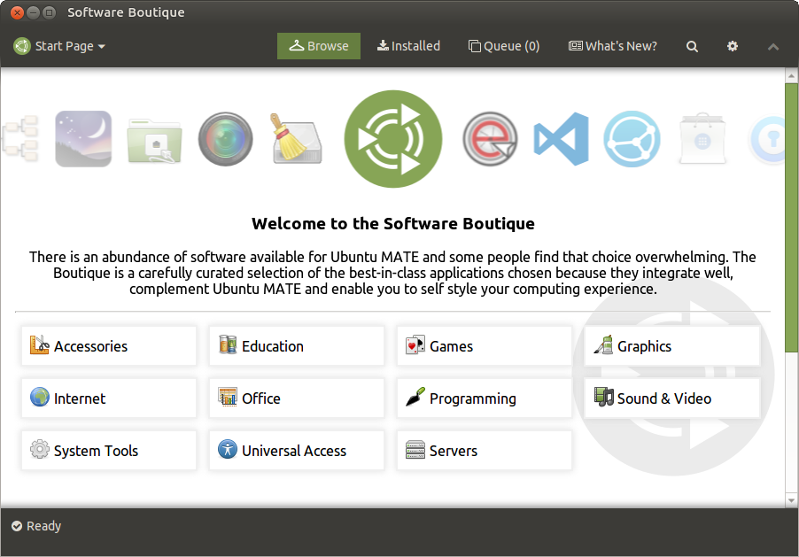
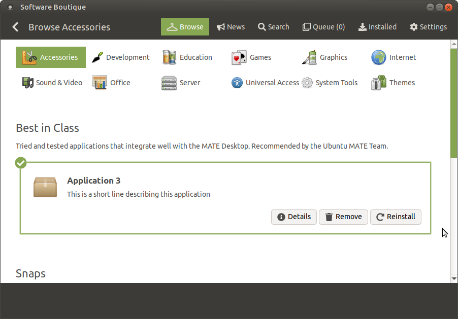
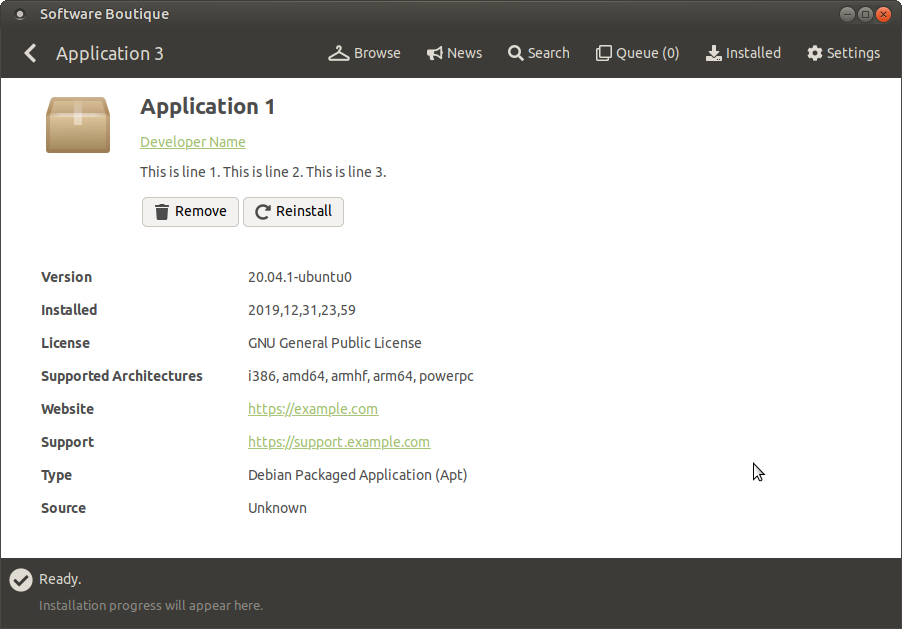

# Software Boutique 2.0 "Prototype"

An easy-to-use software distribution program for Ubuntu MATE. The team curates
a selection of tried & tested applications that integrate well with the Ubuntu
MATE desktop.

Complimentary to the [Welcome program](https://github.com/ubuntu-mate/ubuntu-mate-welcome).

This repository was to be a WebKitGTK front-end to
[python3-libboutique](https://github.com/ubuntu-mate/python3-libboutique).

## Archived for historic reasons

Development for Software Boutique 2.0 started as far back as late 2016.
Built using the same technology as Ubuntu MATE Welcome, which was
GTK for Python and WebKitGTK, essentially a hybrid 'web' desktop application
(but it's not Electron!) This is what [lah7] was familiar with after working on
the **Welcome** program.

As the application became complex to develop, it was eventually abandoned.
Building web 'desktop' app like this added boilerplate, as a web environment
needs to be adapted for a native look and feel and integration with the system.
If [lah7] developed this application again, it would be
using a native UI framework. Not only for superior integration and speed, but
for a more robust codebase and architecture.

This version had a new objective to be more than just a curation of applications,
but to be a _real_ software centre (for apt and snap formats)

**Branches:**

* **master** - the latest, _unfinished_ development.
* **[demo](https://github.com/lah7/software-boutique-2.0-prototype/tree/demo) (2017)** - A compiled copy for showing [Wimpy].
* **[testing-only](https://github.com/lah7/software-boutique-2.0-prototype/tree/testing-only) (2017)** - [lah7] and [Wimpy] met in 2017 (for the first time in person) at Canonical's offices for a Snappy Sprint.

**As featured online:**

* https://www.omgubuntu.co.uk/2017/06/ubuntu-mate-new-software-boutique
* https://ubuntu-mate.community/t/archive-sneak-peek-new-software-boutique-2-0/13891

## Screenshots

#### Start page (2017)

#### Browse page (2019)

#### Viewing details for an application (2019)

## Building

The development environment was Ubuntu MATE 16.04. It's unlikely to run on newer
releases of Ubuntu. Additional dependencies include:

    sudo apt-get install git gir1.2-snapd-1 node-less

After cloning the repository locally, you must build some assets.

To compile the visual styles - these are required:

    ./scripts/build-css.sh

To include the curated index, you'll need to clone
[software-boutique-curated-apps](https://github.com/ubuntu-mate/software-boutique-curated-apps)
into an adjacent directory.

    ./scripts/build-index.sh

To generate locales:

    ./scripts/build-locale-folder.sh

[lah7]: https://github.com/lah7
[Wimpy]: https://github.com/flexiondotorg
